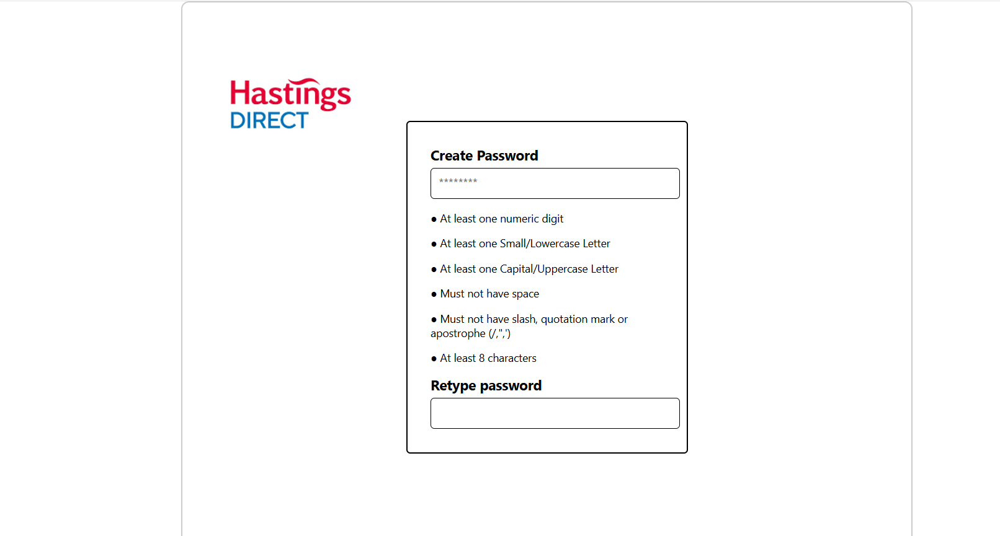

# Password Validator

This is a simple password validation tool that checks password strength based on given rules and requirements. The requirements are listed below:

### Requirements
- At least one numeric digit
- At least one small/lowercase letter
- At least one capital/uppercase letter
- Must not have space
- Must not have slash, quotation marks or apostrophe (/,",')
- At least 8 characters

## Front-end
Front end design


The UI is to be designed with the React framework. According to the planned sketch on Excalidraw, the result of the App.js is displayed below:



## Installation
Clone the repository:
```sh
git clone https://github.com/gellilazeru/password_validator.git
