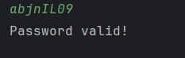
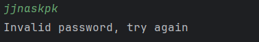

# Password Validator

This project provides a simple password validation tool that checks the strength of a password based on several rules and requirements. It ensures that the password meets the security standards, making it more secure for users.

### Requirements
- At least one numeric digit
- At least one small/lowercase letter
- At least one capital/uppercase letter
- Must not have space
- Must not have slash, quotation marks or apostrophe (/,",')
- At least 8 characters

# Features

## Front-end

Front end design


The UI is to be designed with the React framework. According to the planned sketch on Excalidraw, the result of the App.js is displayed below:


- Conceals the password
- Displays the requirements 
- Notifies the user that the passwords do not match each other if mistyped

## Back-end
- Backend validation using Scala.
- Validates if the password contains at least one number, one lowercase letter, and one uppercase letter.
- Ensures that no spaces, slashes (`/`), quotation marks (`"`), or apostrophes (`'`) are included.
- Password length check (minimum of 8 characters).


## Installation

To install and run the Password Validator locally:

1. Clone the repository:
   ```bash
   git clone https://github.com/gellilazeru/password-validator.git
   ```

2. Install the front-end dependencies:
   ```bash
   cd password-validator
   npm install
   ```

3. Run the React development server:
   ```bash
   npm start
   ```

4. Install the back-end dependencies for Scala:
   - Make sure you have Scala and sbt installed.
   - Navigate to the back-end folder and run:
     ```bash
     sbt run
     ```

5. The front-end should now be running at `http://localhost:3000` and the back-end at `http://localhost:9000`.

## Usage

Once the app is running, visit the front-end UI on your browser. Enter a password into the input field, and the validator will check if it meets all the required criteria.

You’ll receive real-time feedback indicating if the password is valid or if any rules are violated.

## Tech Stack
- **Front-end:** React.js
- **Back-end:** Scala
- **Build tools:** npm, sbt
- **Version control:** Git

## Screenshots

Here are some examples of the app in action:

- Valid password (Sample Input 1: abjnIL09):
  

- Invalid password (Sample Input 2: jjnaskpk):
  


